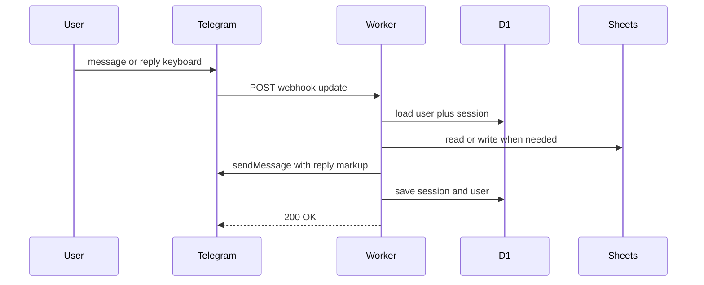

# Cloudflare Workers webhook rewrite

## Goal

Replace long-polling Python (`python -m bot.main`) with a **TypeScript Cloudflare Worker** that:

- Receives Telegram updates via **HTTPS webhook**
- Stores durable settings in **D1** (same schema as [bot/db.py](bot/db.py))
- Persists multi-step conversation state in **D1** (today’s in-memory `context.user_data` cannot survive Worker isolates)
- Talks to Google Sheets via **REST + service-account JWT** (no `gspread`, no local JSON file)

Keep the existing [bot/](bot/) Python tree for local reference until the Worker is verified; production path becomes the Worker.



## Locked technical choices

- **Runtime:** Cloudflare Workers (TypeScript) under `worker/`
- **Framework:** grammY webhook on `fetch`
- **User settings:** D1 table `users` (mirror SQLite columns)
- **Flow state:** D1 table `sessions` (JSON blob for `state` / `draft` / `delete` / …)
- **Sheets:** Google Sheets REST via `fetch`
- **Secrets:** `TELEGRAM_BOT_TOKEN`, `TELEGRAM_WEBHOOK_SECRET`, `GOOGLE_SERVICE_ACCOUNT_JSON`, `TIMEZONE`
- **Locales:** import existing [locales/*.json](locales/) (same keys as [bot/i18n.py](bot/i18n.py))

## Repo layout (new)

```
worker/
  package.json
  wrangler.toml
  src/index.ts
  src/db.ts
  src/i18n.ts
  src/ledger.ts
  src/sheets.ts
  src/keyboards.ts
  src/states.ts
  src/handlers/
  migrations/0001_init.sql
```

Root README: document Worker deploy as the $0 hosting path; mark Render/polling as unsupported for free always-on.

## D1 schema

- `users`: `telegram_id`, `nickname`, `language`, `currency`, `spreadsheet_id`, `sheet_id`, `sheet_title`, timestamps — same fields as [bot/db.py](bot/db.py)
- `sessions`: `telegram_id`, `data` (JSON), `updated_at` — replaces PTB `user_data` (`state`, `draft`, `delete`, `month_pick`, `sheet_replace`)

## Port map (behavior parity)

- Pure logic: [bot/ledger.py](bot/ledger.py), [bot/states.py](bot/states.py), locale JSON, pure helpers in [bot/sheets.py](bot/sheets.py) (`entries_from_values`, `deletion_requests`)
- Storage: [bot/db.py](bot/db.py) to D1; load/save session around each update; `clear_flow` clears session JSON
- UI: [bot/keyboards.py](bot/keyboards.py) to grammY reply keyboards
- Flows: port state machines from [bot/handlers/](bot/handlers/) (onboarding, entry, delete, reports, settings, router)
- Sheets: `link_new_tab`, `list_entries`, `append_entry`, `delete_rows`, `service_account_email`
- Do not port `run_polling` or `asyncio.to_thread`

## Sheets auth on Workers

1. Store full service-account JSON as Worker secret `GOOGLE_SERVICE_ACCOUNT_JSON`
2. Build short-lived RS256 JWT (Web Crypto) with Sheets scope
3. Exchange at `oauth2.googleapis.com/token`
4. Call Sheets REST for values get/append, batchUpdate delete, add sheet, freeze header
5. Users still share spreadsheets with the service account `client_email`

## Deploy and webhook (manual once)

1. Wrangler login; create D1; apply migration
2. `wrangler secret put` for token, webhook secret, Google JSON, timezone
3. `wrangler deploy` to `https://<name>.<subdomain>.workers.dev`
4. `setWebhook` with that URL and `secret_token`; stop local Python / Render first (avoids 409)
5. Worker rejects requests missing matching `X-Telegram-Bot-Api-Secret-Token`

## Free-tier constraints

- Personal-bot traffic fits Workers free request quota
- Large sheet reads for delete/reports can stress CPU/subrequests — keep current load-then-filter behavior; chunk Telegram replies like [bot/handlers/reports.py](bot/handlers/reports.py)
- Cold starts are fine; no Background Worker needed

## Verification

- Manual: `/start` through income/outcome, today/month/balance, delete, settings
- Optional Vitest for ported `ledger.ts`
- `getWebhookInfo` shows Worker URL; no second poller

## Out of scope

- Oracle VM / Render Background Worker
- Deleting Python `bot/` in the first PR (docs deprecate only)
- Migrating existing `bot.db` (fresh D1; users re-link if needed)
