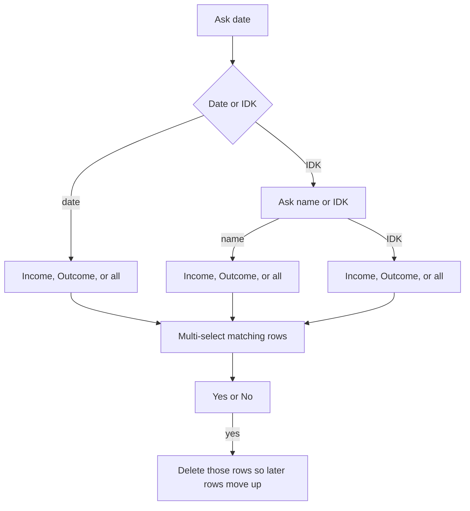

# Telegram ledger bot

New project in the empty repo. One process: long-polling Telegram bot, SQLite for each user’s settings, Google Sheets via a service account.

## How a user sets it up

1. Create a bot with BotFather and put the token in `.env`.
2. Create a Google Cloud service account, enable the Google Sheets API, and save the JSON key locally (gitignored).
3. The user creates or opens their own spreadsheet and shares it with the service account email as **Editor**.
4. `/start` asks for the spreadsheet URL only when this Telegram user has no sheet saved. The bot adds a **new tab** and does not read or change existing tabs. If `Transactions` already exists, it uses `Transactions 2`, and so on.
5. After the tab exists, the bot asks what to call the user, then shows the main menu. Later `/start` skips sheet setup. A missing nickname is asked again.

Fixed English headers, row 1 frozen, so lookups stay stable when the chat language changes:

`Date | Time | Name | Type | Unit Amount | Units | Amount`

Date and time are the save time in `Asia/Yangon` (config default, matching UTC+6:30). Stored values: `YYYY-MM-DD`, `HH:MM`, type `income` or `outcome`, amounts as positive numbers. The sign lives in the type. Income leaves **Unit Amount** and **Units** blank. The bot does not lock cells.

## Chat menus

Main inline keyboard: Income, Outcome, Today, This month, Remaining balance, Delete, Settings. `/cancel` aborts a question flow and returns to the menu. `/menu` reopens it.

**Income:** optional name (Skip stores `Income`), then amount. Units and unit price are not asked.

**Outcome:** optional name (Skip stores `Outcome`), units with **Not applicable**, unit price with **Not applicable**. If both are numbers, the bot shows `units × unit price` with **Confirm** and also accepts a typed replacement. If either is skipped, it asks for the amount. Blank unit fields stay blank.

**Today / This month:** read the bot’s tab and list matching rows (date, time, name, type, units, unit price, amount, currency). Split across messages if the text would exceed Telegram’s limit.

**Remaining balance:** all rows. `sum(income amounts) − sum(outcome amounts)`, plus the two totals.

**Delete:**

Date uses a month calendar (previous / next) and also accepts `YYYY-MM-DD`. Name match is case-insensitive and exact. Each match is a toggle button (date, time, name, amount). **Delete** then **Yes / No**. Deletion uses the Sheets `deleteDimension` API from the highest row number downward so the rest of the tab shifts up. No matches returns to the menu with a short notice.

**Settings:** currency text shown after amounts (default `MMK`); language (English, Burmese, German, Japanese); nickname; replace spreadsheet URL. Replacing the URL asks **Yes / No** first. On yes, the same share-and-create-tab flow runs. The previous spreadsheet is left as it is.

## Language files

Every user-visible string, including buttons, lives in one JSON file per language:

- [locales/en.json](locales/en.json)
- [locales/my.json](locales/my.json)
- [locales/de.json](locales/de.json)
- [locales/ja.json](locales/ja.json)

Keys are shared (`menu.income`, `income.ask_name`, …). The bot looks up the user’s language and falls back to English for a missing key. Sheet headers and stored type values stay English.

## Code layout

- [bot/main.py](bot/main.py) — polling, handlers, `/start`, `/menu`, `/cancel`
- [bot/config.py](bot/config.py) — token, service-account path, SQLite path, timezone
- [bot/db.py](bot/db.py) — SQLite `users`: telegram id, nickname, language, currency, spreadsheet id, sheet id, sheet title
- [bot/sheets.py](bot/sheets.py) — parse a Sheets URL, create the tab, append a row, list rows, delete rows by index
- [bot/ledger.py](bot/ledger.py) — pure helpers: filter by day/month, balance, amount = units × unit price, name defaults
- [bot/i18n.py](bot/i18n.py) — load the four JSON files
- [bot/keyboards.py](bot/keyboards.py) — main menu, settings, calendar, row picker, yes/no
- [bot/handlers/](bot/handlers/) — onboarding, income, outcome, lists, balance, delete, settings
- [requirements.txt](requirements.txt) — `python-telegram-bot`, `gspread`, `google-auth`, `python-dotenv`
- [.env.example](.env.example) and [.gitignore](.gitignore) — token, key file, `bot.db`
- [tests/test_ledger.py](tests/test_ledger.py) — day/month filters, balance sign, outcome amount confirmation math
- [README.md](README.md) — BotFather, service-account share steps, run command

Conversation progress (current question, draft income/outcome, delete filters, selected row numbers) stays in Telegram `user_data` for that chat. Settings survive restart in SQLite. Invalid numbers, a bad URL, or a sheet that is not shared with the service account are re-asked with the service account email included in the error.
